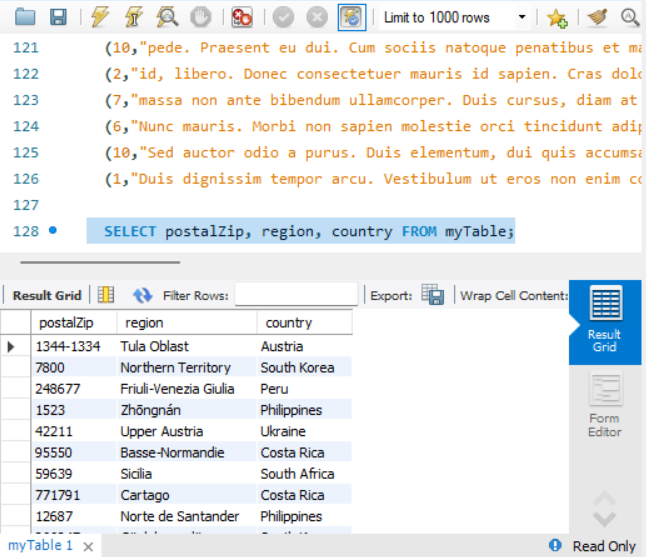
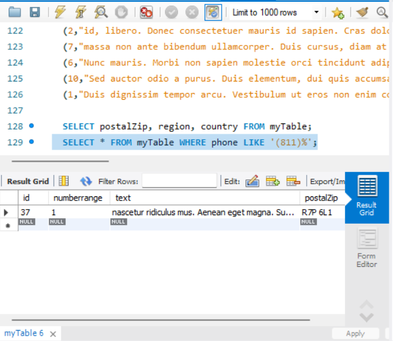
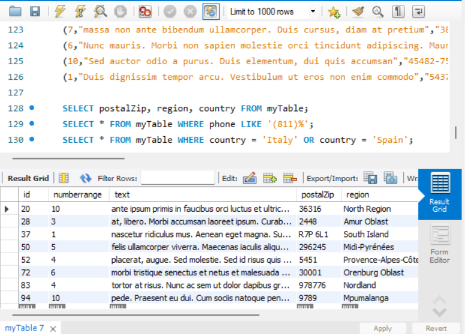
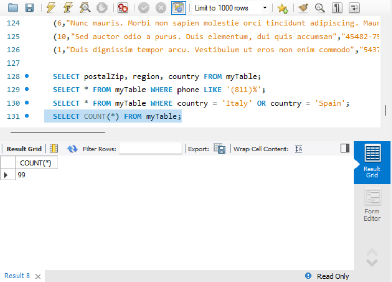
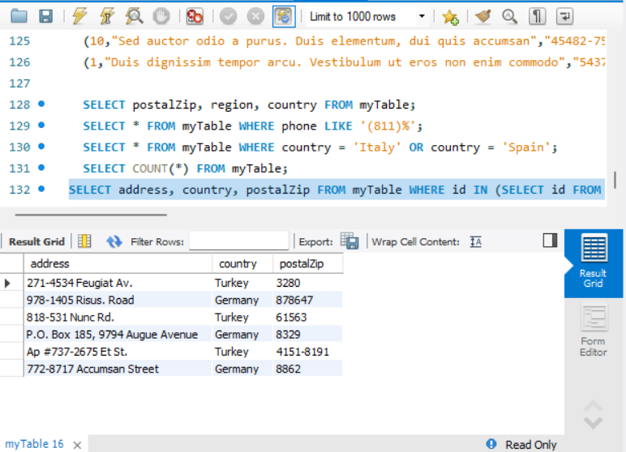
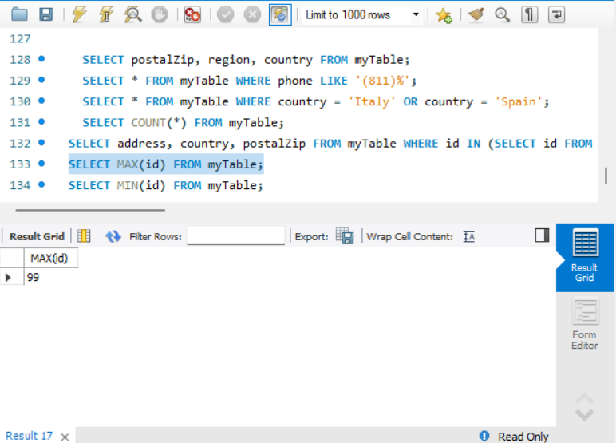
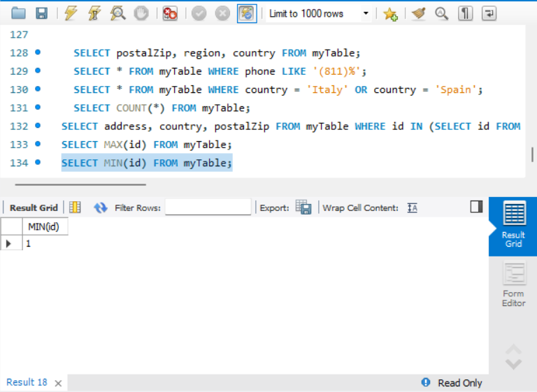
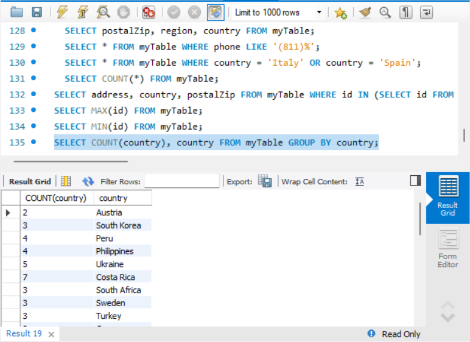
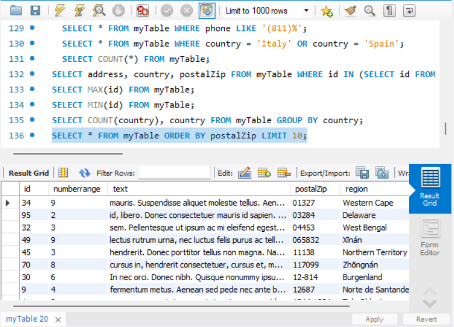
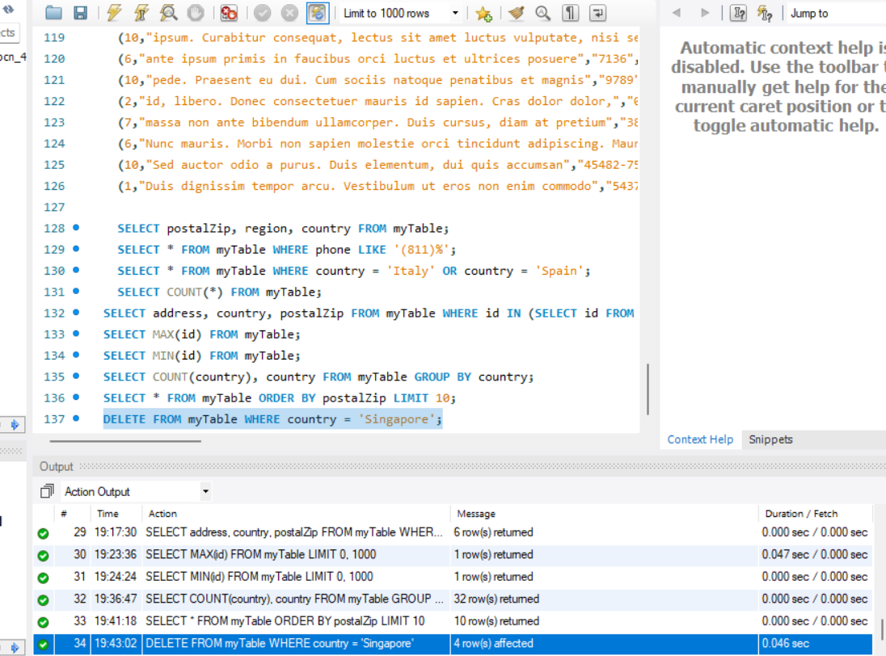

# **Paso 1**

---
---
# **Paso 2**

---
---
# **Paso 3**

---
---
# **Paso 4**

---
---
# **Paso 5**

  SELECT numberrange FROM myTable WHERE country = 'Italy' OR country = 'Turkey' AND (address, country, postalZip) IN (SELECT address, country, postalZip FROM myTable);

---
---
# **Paso 6**

---
---
# **Paso 7**

---
---
# **Paso 8**

---
---

# **Paso 9**
